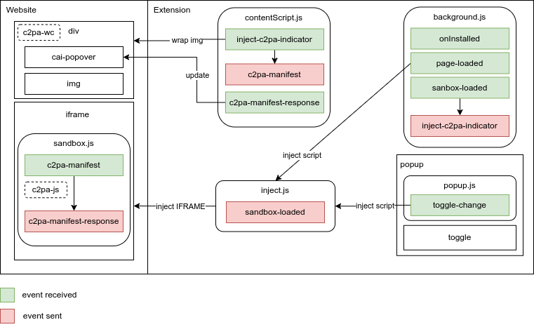

# C2PA Content Credentials Browser Extension

## Introduction to C2PA

The C2PA (Coalition for Content Provenance and Authenticity) is an open standard that aims to foster a thriving ecosystem around content authenticity. By creating a detailed provenance for digital media, this initiative seeks to empower content creators, publishers, and consumers to verify the source and history of media content.

In a world where misinformation can spread rapidly, establishing trust and authenticity in digital media has never been more critical. C2PA addresses this by providing a robust framework for content attribution, ensuring that creators can claim their work and audiences can confidently assess the credibility of the content they consume. For more information, please visit [c2pa.org](https://c2pa.org).

This repository provides a reference implementation of a C2PA manifest verifer that can be run as a browser extension. Its purpose is to enable users to analyse images present in a webpage and run a C2PA manifest verifications when available. This covers use cases where images are embedded in a webpage and the user wants to verify the authenticity of the image, as well as providing a secondary verification alternative for images on websites that implement their own C2PA validation.

It is provided as a beta version and it currently has some known limitations that we plan to address in future versions.

An extended set of open source tools are being developed to support the C2PA standard in additional integration scenarios. For a more detailed list of libraries, please visit [opensource.contentauthentiticy](https://opensource.contentauthenticity.org/).

## Getting Started

### Chrome Store (Revision Pending)

You can install the extension directly from the [Chrome Store](https://chrome.google.com/webstore/)

### Local installation

You can also check out the code and install the extension locally

1. Clone this repository.
2. Run `npm install`.
3. Open Chrome and go to `chrome://extensions`.
4. Enable Developer Mode (top right corner).
5. Click on `Load unpacked`.
6. Select the browser extension folder.
7. Try it out!

## Usage

Once the extension is installed, click on the plugin icon on the top right, it will display a popup window.

Switch the toggle to "ON".

When the extension is enabled, you will now see the C2PA icon on top of every image that contains a C2PA manifest in the website loaded in the active tab.

## Architecture

This C2PA validator is built as a Chrome browser extension. When enabled, it will inject a script into the current webpage, that will create a hidden sandboxed iframe to handle the C2PA validation. This script will then look for all the images visible in the webpage and communicate with the sandbox to check if they contain a C2PA manifest. If they do, it will display the C2PA icon on top of the image. When the user hovers over the icon, it will display a popup window with the C2PA manifest information.

The sandboxed iframe is used to ensure that the C2PA validation libraries [c2pa-js](https://opensource.contentauthenticity.org/docs/js-sdk/getting-started/overview/) can be accessed in a secure environment. The communication is carried out by sending window messages between the main script and the sandboxed iframe. The main script will send a message to the sandboxed iframe with the image information, and the sandboxed iframe will send back a message with the C2PA manifest information if available.



## Known limitations

### Need to override existing C2PA components

In order to handle websites that are already using the official c2pa web components library [c2pa-wc](https://www.npmjs.com/package/c2pa-wc) and to maintain a consisten UI experience, we need to actively remove all the cai icons that are already present to avoid conflicts and misleading information.

Here is a list of the components we currently remove when the extension is enabled:

- `cai-popover` | `cai-indicator` | `cai-manifest-summary`

### Image types and method support

Because the browser extension runs completely locally on the browser, there are restrictions to access the website's images depending on how they are made available. Most  will be accessed by their property src as long as it is a public url, otherwise the extension will try to transform it to a dataURI so that it can be processed in the sandbox, but this is also known not to work in all the cases, depending on the type and location of the images.

### Inclusion of official c2pa-wc library

This library is added to the root of project because we've updated it, but it originally come from the official C2PA repository: `https://github.com/contentauth/c2pa-js/tree/main/packages/c2pa-wc`

To update it, you can follow the instructions below:

1. Fork the official C2PA repository. `https://github.com/contentauth/c2pa-js/tree/main/`
2. Replace the `c2pa-wc` folder in the cloned repo with the one from the current extension. (In order to keep the changes we've made).
3. Make your updates in the `c2pa-wc` folder.
4. Build the library using the following commands:

```sh {"id":"01HG9279TGG7BNNZAR7117H2WP"}
npm install -g @microsoft/rush
rush install
rush build 
```

You can also follow the `README` at the root of the forked repository.

5. After a successful build, you can copy the updated version of `c2pa-wc` at the root of this folder.
6. Then you can follow the `Contributing` instructions below to test your changes and open a Pull Request.

## Contributions

We encourage anyone in the community to contribute to the project, this can be done in different ways

### Code contributions

Fork the repository and create a new branch for your feature.

We currently use the following versions of Node and NPM:
`npm: >= 10.2.2`
`node: >= 20.9.0`

Follow the `Local Installation` instructions above to get your local version ready.

Run `npm run test` to ensure that all tests are passing.

Implement your feature, as necessary, add tests if needed and send a Pull Request

(We recommend that you run the linter first: `npm run lint`)

### Issues

Alternatively, you can create an issue with a bug report or a new feature request in the Github project.

## Versioning

When contributing, make sure to update the version of the library in the `package.json` file.

## Building

In order to have a light version of the extension, where you have only the necessary files that the extension needs to work, you can run:
```
./build.sh
```

It will create a `build` folder. This contains the final extension code.

## License

This project is licensed under the MIT License - see the [LICENSE](LICENSE) file for details.

## Acknowledgements

TODO : Acknowledgements
