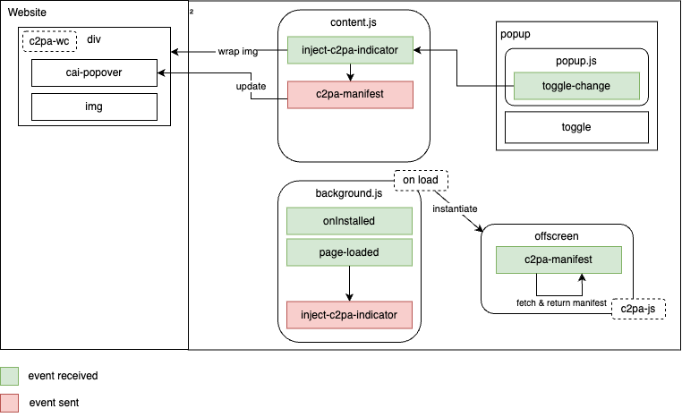

# C2PA Content Credentials Browser Extension

In a world where misinformation or AI generated content can spread rapidly, establishing trust and authenticity in digital media has never been more critical. The Coalition for Content Provenance and Authenticity [C2PA](https://c2pa.org/) is a cross-industry standards development organization addressing the prevalence of misleading information online. This timely issue is tackled through the development of open technical standards for certifying the source and history (or provenance) of media content referred to as [Content Credentials](https://contentcredentials.org/).

This repository provides an implementation of a C2PA manifest validator running directly in Chrome as a browser extension. Its purpose is to validate and display Content Credentials for JPG images that embed a C2PA compliant manifest. Thanks to the validation being done independently of the site a user is surfing on, it should enable users to make better decisions about which image should and shouldn’t be trusted. 

This project is built on top of the open source C2PA-JS Library built by the [Content Authenticity Initiative team](https://opensource.contentauthenticity.org/) and we would like to thank them here for their pioneering work. The [full list of libraries](THIRD_PARTY_LICENSES.md) used in this project can be found here. 

*Warning:* This is an early release of this extension subject to material changes. A number of issues are known and we welcome feedback by submitting [issues](https://github.com/digimarc-corp/c2pa-content-credentials-extension/issues). 


## Getting started

### Chrome Web Store

The extension has been submitted to the Chrome Web Store and is pending approval. We will post a link here once it has been approved.
Meanwhile you can fall back to a local installation as specified below.


### Local installation

1. Download the zip archive of the [latest release](https://github.com/digimarc-corp/c2pa-content-credentials-extension/releases/download/v0.0.1-beta/c2pa-content-credentials-extension-v0.0.1-beta.zip)
2. Unzip the archive
2. Open Chrome and go to `chrome://extensions`.
3. Enable Developer Mode (top right corner).
4. Click on `Load unpacked`.
5. Select the unzipped folder.
6. Try it out! (see Usage below)

### Usage

Once the extension is installed, click on the plugin icon on the top right, it will display a popup window.

Switch the toggle to `ON`.

When the extension is enabled, you will now see the C2PA pin on top of every image that contains a C2PA manifest in the website loaded in the active tab. Hover the mouse on the pin and the extension will reveal the image provenance information.

Test the extension on the 2 images below. One of the photo was taken last year and one was generated by AI. Can you guess which one is real? The extension will help you!


## Building the extension from the source

You can also check out the code and install the extension locally

1. Clone this repository.
2. Fetch the `c2pa-js` fork with: `git submodule update --init --recursive`
3. Run: `git submodule update --remote`
4. Run `npm install`.
5. Build the extension: `./build.sh`
6. Open Chrome and go to `chrome://extensions`.
7. Enable Developer Mode (top right corner).
8. Click on `Load unpacked`.
9. Select the `build` extension folder.
10. Try it out! (see Usage)


## Architecture

This C2PA validator is built as a Chrome browser extension. When enabled, it will inject a script into the current webpage, that will create a hidden sandboxed iframe to handle the C2PA validation. This script will then look for all the images visible in the webpage and communicate with the sandbox to check if they contain a C2PA manifest. If they do, it will display the CR pin on top of the image. When the user hovers over the pin, it will display a popup window with the C2PA manifest information.

The sandboxed iframe is used to ensure that the C2PA validation libraries [c2pa-js](https://opensource.contentauthenticity.org/docs/js-sdk/getting-started/overview/) can be accessed in a secure environment. The communication is carried out by sending window messages between the main script and the sandboxed iframe. The main script will send a message to the sandboxed iframe with the image information, and the sandboxed iframe will send back a message with the C2PA manifest information if available.



## Known limitations

### Restricted to JPEG images

The current version of the extension only supports JPG / JPEG images. We are working on adding support for more image types.

### Need to override existing C2PA components

In order to handle websites that are already using the official C2PA web components library [c2pa-wc](https://www.npmjs.com/package/c2pa-wc) and to maintain a consistent UI experience, we need to actively remove all the cai icons that are already present to avoid conflicts and misleading information.

Here is a list of the components we currently remove when the extension is enabled:

- `cai-popover` | `cai-indicator` | `cai-manifest-summary`

### Image types and method support

Because the browser extension runs completely locally in the browser, there are restrictions to access the website's images depending on how they are made available. Most will be accessed by their property `src` as long as it is a public url, otherwise the extension will try to transform it to a `dataURI` so that it can be processed in the sandbox, but this is also known not to work in all the cases, depending on the type and location of the images.

### Inclusion of official c2pa-wc library

This library is added to the root of project because we've updated it, but it originally come from the official C2PA repository: `https://github.com/contentauth/c2pa-js/tree/main/packages/c2pa-wc`.

Note that we are working on making it a public fork referenced by the extension but meanwhile, to update it, you can follow the instructions below:

1. Fork the official C2PA repository. `https://github.com/contentauth/c2pa-js/tree/main/`
2. Replace the `c2pa-wc` folder in the cloned repo with the one from the current extension. (In order to keep the changes we've made).
3. Make your updates in the `c2pa-wc` folder.
4. Build the library using the following commands:

```sh {"id":"01HG9279TGG7BNNZAR7117H2WP"}
npm install -g @microsoft/rush
rush install
rush build 
```

You can also follow the `README` at the root of the forked repository.

5. After a successful build, you can copy the updated version of `c2pa-wc` at the root of this folder.
6. Then you can follow the `Contributing` instructions below to test your changes and open a Pull Request.

## Contributions

We encourage anyone in the community to contribute to the project, this can be done in different ways:

### Code contributions

Fork the repository and create a new branch for your feature.

We currently use the following versions of Node and NPM:
`npm: >= 10.2.2`
`node: >= 20.9.0`

Follow the `Local Installation` instructions above to get your local version ready.

Run `npm run test` to ensure that all tests are passing.

Implement your feature, as necessary, add tests if needed and send a Pull Request

(We recommend that you run the linter first: `npm run lint`)

### Issues

Alternatively, you can create an issue with a bug report or a new feature request in the Github project.

## Versioning

When contributing, make sure to update the version of the library in the `package.json` file.

## Building

In order to have a light version of the extension, where you have only the necessary files that the extension needs to work, you can run:
```
./build.sh
```

It will create a `build` folder. This contains the final extension code.

## License

This project is licensed under the MIT License - see the [LICENSE](LICENSE) file for details.

## About Digimarc

This project has been built by the team at Digimarc Labs. [Digimarc](https://www.digimarc.com/products/digital-content-authentication) is a digital watermarking leader committed to building an digital ecosystem of trust protecting content creators and consumers.

## Attributions

This project is built on top of many great open source projects starting with C2PA-JS Library built by the [Content Authenticity Initiative team](https://opensource.contentauthenticity.org/). We would like to thank them here for their pioneering work. 
The [full list of libraries and their respective licenses](https://github.com/digimarc-corp/c2pa-content-credentials-extension/blob/main/THIRD_PARTY_LICENSES.md) used in this project can be found here. 
